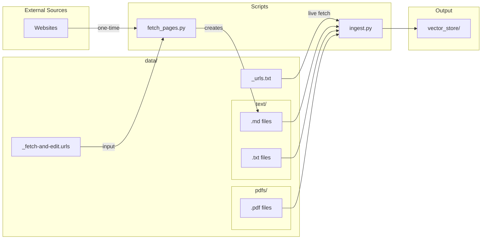

# Data Ingestion Guide

This document explains how to manage and ingest data sources for the Oregon Soccer Referee Concierge.

## Directory Structure

```
data/
├── _urls.txt             # URLs fetched live during ingestion (not ingested as content)
├── _fetch-and-edit.urls  # URLs for fetch_pages.py to download (not ingested)
├── text/                 # Markdown and text files (curated content)
│   ├── OSRO-FAQs.md
│   ├── OYSA-referee-certification.md
│   └── ...
└── pdfs/                 # PDF documents
    ├── 2025-26-State-Cup-Rules.pdf
    ├── OYSA-Competitive-Youth-Soccer-League-Rules.pdf
    └── ...
```

### What Goes Where

| Directory | Contents | Notes |
|-----------|----------|-------|
| `data/_urls.txt` | URLs to fetch **live** during ingestion | Content is fetched fresh each time `ingest.py` runs |
| `data/_fetch-and-edit.urls` | URLs for one-time download | Used with `fetch_pages.py` for curated content |
| `data/text/` | `.md` and `.txt` files | Editable content - best for curated web pages |
| `data/pdfs/` | PDF documents | League rules, handbooks, etc. |

**Note:** Files starting with `_` are excluded from ingestion. Use this prefix for configuration files or content you don't want indexed.

## Workflow Overview



## Scripts

### fetch_pages.py - Download and Curate Web Content

Downloads web pages as markdown files that you can edit before ingestion.

```bash
# Fetch a single URL
./scripts/fetch_pages.py https://www.theifab.com/laws/latest/fouls-and-misconduct/

# Fetch multiple URLs
./scripts/fetch_pages.py https://url1.com https://url2.com

# Fetch from a file (one URL per line)
./scripts/fetch_pages.py --file data/fetch-and-edit.urls
```

**Output:** Markdown files are saved to `data/text/` with filenames derived from the URL.

**URL file format:**
```
# Comments start with #
https://example.com/page1

# Optional: specify output filename after URL
https://example.com/page2  my-custom-name
```

**What it does:**
1. Downloads the HTML from each URL
2. Extracts the main content (removes nav, footer, scripts, etc.)
3. Converts to clean markdown
4. Adds YAML frontmatter with source URL and title
5. Saves to `data/text/`

**Curating content:**
After downloading, edit the markdown files to:
- Remove irrelevant sections (cookie notices, sidebars)
- Fix formatting issues
- Add clarifying notes
- Remove duplicate or outdated information

**RefTown URLs (reftown.com):**
Many documents are hosted on [reftown.com](https://reftown.com) and require authentication. Both `fetch_pages.py` and `ingest.py` detect reftown.com URLs and log in automatically when these environment variables are set:
- `REFTOWN_USERNAME` – your RefTown username or email
- `REFTOWN_PASSWORD` – your RefTown password

If not set, reftown.com URLs are requested without auth (you may get the login page instead of actual content).

### ingest.py - Build the Vector Store

Processes all documents and builds the FAISS vector store.

```bash
./ingest.py
```

**What it processes:**
1. `data/text/*.txt` - Text files
2. `data/text/*.md` - Markdown files  
3. `data/pdfs/*.pdf` - PDF documents
4. `data/urls.txt` - URLs fetched live

**Output:** Vector store saved to `vector_store/`

**Important:** Only files in the subdirectories (`text/`, `pdfs/`) are ingested. Files directly in `data/` (like `urls.txt`) are not ingested as content.

## Adding New Content

### Option 1: Curated Web Content (Recommended)

Best for content you want to edit or that doesn't change frequently.

```bash
# 1. Add URLs to fetch-and-edit.urls
echo "https://example.com/rules-page" >> data/fetch-and-edit.urls

# 2. Download as markdown
./scripts/fetch_pages.py --file data/fetch-and-edit.urls

# 3. Edit the generated file in data/text/
# (Remove unwanted sections, fix formatting, etc.)

# 4. Rebuild the vector store
./ingest.py
```

### Option 2: Live URLs

Best for frequently-updated content where you always want the latest version.

```bash
# 1. Add URL to urls.txt
echo "https://example.com/announcements" >> data/urls.txt

# 2. Rebuild (fetches fresh content)
./ingest.py
```

### Option 3: PDF Documents

```bash
# 1. Copy PDF to pdfs directory
cp ~/Downloads/new-rules.pdf data/pdfs/

# 2. Rebuild
./ingest.py
```

## Production Deployment

After updating content locally:

```bash
# 1. Rebuild the vector store
./ingest.py

# 2. Sync to Cloud Storage and deploy
./scripts/update-vector-store.sh
```

## Tips

- **Prefer curated content** over live URLs for better quality and control
- **Use descriptive filenames** for markdown files (e.g., `OYSA-referee-certification.md`)
- **Check the output** of `ingest.py` to verify all sources are loaded
- **Keep PDFs organized** with clear names indicating the source and date
