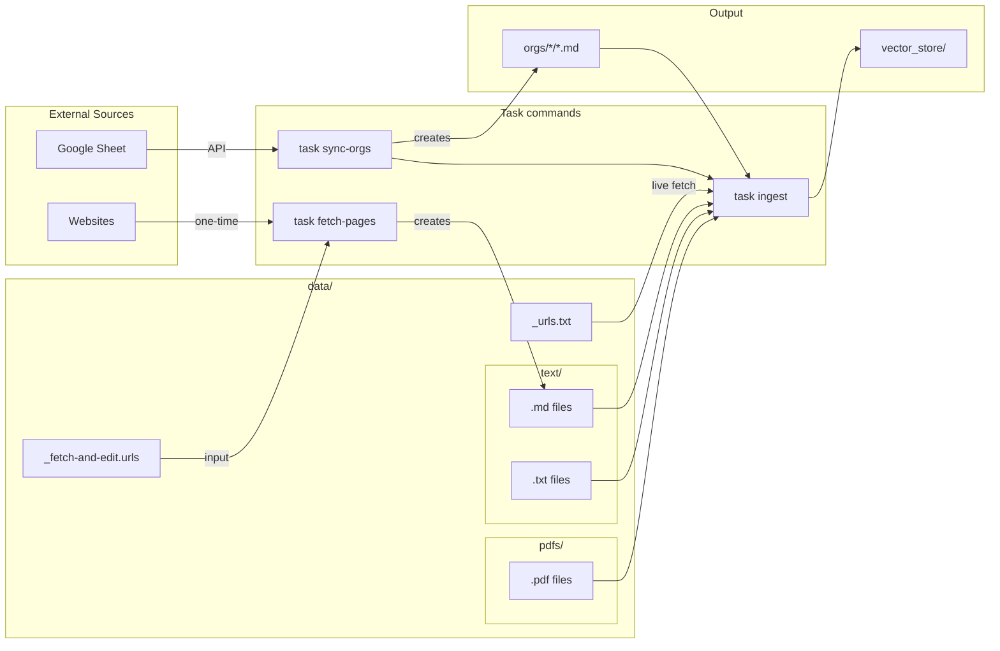

# Data Ingestion Guide

This document explains how to manage and ingest data sources for the Oregon Soccer Referee Concierge. **Ingestion and fetch scripts are run via Task** (e.g. `task ingest`, `task fetch-pages`); direct invocation of scripts is not recommended.

## Directory Structure

```
data/
├── _urls.txt             # URLs fetched live during ingestion (not ingested as content)
├── _fetch-and-edit.urls  # URLs for fetch_pages.py to download (not ingested)
├── orgs/                 # Organization summaries (generated by sync-orgs)
│   └── <org_slug>/
│       └── <org_slug>.md
├── text/                 # Markdown and text files (curated content)
│   ├── OSRO-FAQs.md
│   ├── OYSA-referee-certification.md
│   └── ...
└── pdfs/                 # PDF documents
    ├── 2025-26-State-Cup-Rules.pdf
    ├── OYSA-Competitive-Youth-Soccer-League-Rules.pdf
    └── ...
```

### What Goes Where

| Directory | Contents | Notes |
|-----------|----------|-------|
| `data/_urls.txt` | URLs to fetch **live** during ingestion | Content is fetched fresh each time you run `task ingest` |
| `data/_fetch-and-edit.urls` | URLs for one-time download | Used with `task fetch-pages` for curated content |
| `data/orgs/` | `<org_slug>.md` files per organization | Generated by `task sync-orgs` from Google Sheet |
| `data/text/` | `.md` and `.txt` files | Editable content - best for curated web pages |
| `data/pdfs/` | PDF documents | League rules, handbooks, etc. |

**Note:** Files starting with `_` are excluded from ingestion. Use this prefix for configuration files or content you don't want indexed.

## Workflow Overview


```mermaid
flowchart LR
    subgraph sources [External Sources]
        web[Websites]
        sheet[Google Sheet]
    end

    subgraph datadir [data/]
        urls["_urls.txt"]
        fetchurls["_fetch-and-edit.urls"]
        subgraph text [text/]
            md[".md files"]
            txt[".txt files"]
        end
        subgraph pdfs [pdfs/]
            pdf[".pdf files"]
        end
    end

    subgraph tools [Task commands]
        sync["task sync-orgs"]
        fetch["task fetch-pages"]
        ingest["task ingest"]
    end

    subgraph output [Output]
        orgs["orgs/*/*.md"]
        vs["vector_store/"]
    end

    web -->|one-time| fetch
    sheet -->|API| sync
    fetchurls -->|input| fetch
    fetch -->|creates| md

    sync -->|creates| orgs
    sync --> ingest
    urls -->|live fetch| ingest
    md --> ingest
    txt --> ingest
    pdf --> ingest
    orgs --> ingest
    ingest --> vs
```

## Scripts (run via Task)

### task fetch-pages - Download and Curate Web Content

Downloads web pages as markdown files that you can edit before ingestion.

```bash
# Fetch a single URL
task fetch-pages -- https://www.theifab.com/laws/latest/fouls-and-misconduct/

# Fetch multiple URLs
task fetch-pages -- https://url1.com https://url2.com

# Fetch from a file (one URL per line)
task fetch-pages -- --file data/fetch-and-edit.urls
```

**Output:** Markdown files are saved to `data/text/` with filenames derived from the URL.

**URL file format:**
```
# Comments start with #
https://example.com/page1

# Optional: specify output filename after URL
https://example.com/page2  my-custom-name
```

**What it does:**
1. Downloads the HTML from each URL
2. Extracts the main content (removes nav, footer, scripts, etc.)
3. Converts to clean markdown
4. Adds YAML frontmatter with source URL and title
5. Saves to `data/text/`

**Curating content:**
After downloading, edit the markdown files to:
- Remove irrelevant sections (cookie notices, sidebars)
- Fix formatting issues
- Add clarifying notes
- Remove duplicate or outdated information

**RefTown URLs (reftown.com):**
Many documents are hosted on [reftown.com](https://reftown.com) and require authentication. Both the fetch-pages and ingest tasks detect reftown.com URLs and log in automatically when these environment variables are set (Task loads `.env` from the project root):
- `REFTOWN_USERNAME` – your RefTown username or email
- `REFTOWN_PASSWORD` – your RefTown password

If not set, reftown.com URLs are requested without auth (you may get the login page instead of actual content).

### task sync-orgs - Sync Organization Summaries from Google Sheet

Reads organization data from a Google Sheet via the Google Sheets API and generates or overwrites `data/orgs/<org_slug>/<org_slug>.md` for each row (e.g. `orgs/NCSC/NCSC.md`). **The ingest task runs sync-orgs first**, so org summaries are refreshed from the sheet before every vector store build.

**Sheet URL:** [https://docs.google.com/spreadsheets/d/1UfzRZQPEhV1mYemzhwSFbi66hJaEbFiMIP6tSEO4c_I/edit?gid=1877948281](https://docs.google.com/spreadsheets/d/1UfzRZQPEhV1mYemzhwSFbi66hJaEbFiMIP6tSEO4c_I/edit?gid=1877948281)

**Required:** The spreadsheet must be shared with the service account (the email in `backend/oregon-referees*.json`). Credentials are loaded from `backend/oregon-referees*.json`.

```bash
# Sync using default sheet and worksheet
task sync-orgs

# Override sheet ID and worksheet GID
task sync-orgs -- --sheet-id OTHER_SHEET_ID --gid 1234567890
```

**Sheet columns (in order):**

| Column | Use |
|--------|-----|
| Org ID | Org code; also source for directory name (spaces → underscores) |
| Reftown Link | reftown_link |
| Reftown ID | Optional metadata |
| NWSC Payor League | nwsc_payor_league, signup_type derivation |
| Org Name | Full organization name |
| Contact | Assignor/contact name |
| Email | Contact email |
| Phone | Contact phone |
| League | League name |
| Rules URL | Rules document URL |
| Pay URL | Pay table URL |
| Homepage | Organization homepage |
| City | City (optional) |
| State | State (always present) |
| General Playing Dates | Playing season dates |
| Info | Additional info section |

**Output:** One `<org_slug>.md` file per organization in `data/orgs/<org_slug>/` (e.g. `orgs/NCSC/NCSC.md`). Directories are created if they do not exist.

### task ingest - Build the Vector Store

Processes all documents and builds the FAISS vector store.

```bash
task ingest
```

**What it does:**
1. Runs `task sync-orgs` to refresh org summaries from the Google Sheet
2. Processes `data/text/*.txt`, `data/text/*.md`, `data/pdfs/*.pdf`, `data/orgs/*/*.md`, and `data/urls.txt`

**Output:** Vector store saved to `vector_store/`

**Important:** Only files in the subdirectories (`text/`, `pdfs/`) are ingested. Files directly in `data/` (like `urls.txt`) are not ingested as content.

## Adding New Content

### Option 1: Curated Web Content (Recommended)

Best for content you want to edit or that doesn't change frequently.

```bash
# 1. Add URLs to fetch-and-edit.urls
echo "https://example.com/rules-page" >> data/fetch-and-edit.urls

# 2. Download as markdown
task fetch-pages -- --file data/fetch-and-edit.urls

# 3. Edit the generated file in data/text/
# (Remove unwanted sections, fix formatting, etc.)

# 4. Rebuild the vector store
task ingest
```

### Option 2: Live URLs

Best for frequently-updated content where you always want the latest version.

```bash
# 1. Add URL to urls.txt
echo "https://example.com/announcements" >> data/urls.txt

# 2. Rebuild (fetches fresh content)
task ingest
```

### Option 3: PDF Documents

```bash
# 1. Copy PDF to pdfs directory
cp ~/Downloads/new-rules.pdf data/pdfs/

# 2. Rebuild
task ingest
```

## Production Deployment

After updating content locally:

```bash
# 1. Rebuild the vector store
task ingest

# 2. Sync to Cloud Storage and deploy
task update-vector-store
```

## Tips

- **Prefer curated content** over live URLs for better quality and control
- **Use descriptive filenames** for markdown files (e.g., `OYSA-referee-certification.md`)
- **Check the output** of `task ingest` to verify all sources are loaded
- **Keep PDFs organized** with clear names indicating the source and date
