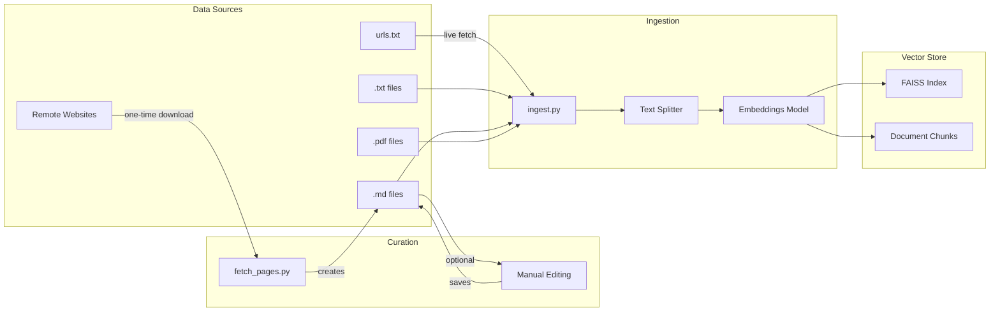

# Oregon Soccer Referee Concierge

An AI-powered concierge for Oregon soccer referees, providing quick answers about soccer rules, referee procedures, and Oregon-specific regulations.

**Live Application:** [https://oregonreferee.app](https://oregonreferee.app)

## Project Structure

```
OSROAgent/
├── backend/              # FastAPI backend
│   ├── __init__.py
│   ├── main.py           # API endpoints
│   ├── license_service.py # USSF license lookup
│   └── license_data.json # License reference data
├── frontend/             # Vite + React frontend
│   ├── public/
│   ├── src/
│   │   ├── App.jsx       # Main chat component
│   │   ├── index.css     # Tailwind CSS
│   │   └── main.jsx      # React entry point
│   ├── index.html
│   ├── package.json
│   ├── tailwind.config.js
│   └── vite.config.js
├── scripts/              # Utility scripts
│   ├── fetch_pages.py    # Download webpages as markdown
│   ├── build-push.sh     # Build and push Docker images
│   ├── deploy-cloudrun.sh # Deploy to Cloud Run
│   └── update-vector-store.sh # Sync vector store to GCS
├── data/                 # Source documents for ingestion
├── vector_store/         # Generated FAISS index
├── ingest.py             # Document ingestion script
├── requirements.txt      # Python dependencies
├── LICENSE
└── README.md
```

## Setup

### Prerequisites

- Python 3.10+
- Node.js 18+
- Google API Key for Gemini

### Backend Setup

1. Create and activate a virtual environment:
   ```bash
   python -m venv venv
   source venv/bin/activate  # On Windows: venv\Scripts\activate
   ```

2. Install Python dependencies:
   ```bash
   pip install -r requirements.txt
   ```

3. Add your Google API key to a `.env` file in the project root (e.g. `GOOGLE_API_KEY=your-api-key-here`). Docker Compose and the VS Code/Cursor launch config load it automatically; for running the backend directly, source `.env` or export the variable.

4. (Optional) Ingest documents for local use: add PDFs or text files to `data/`, then run `./ingest.py` to build `./vector_store`. For production, run `./ingest.py` then `./scripts/update-vector-store.sh` to sync the index to Cloud Run (see Production section).

5. Start the backend server:
   ```bash
   cd backend
   uvicorn main:app --reload
   ```

### Frontend Setup

1. Install Node.js dependencies:
   ```bash
   cd frontend
   npm install
   ```

2. Start the development server:
   ```bash
   npm run dev
   ```

3. Open http://localhost:5173 in your browser

## Usage

1. Add referee documents, rules PDFs, or text files to the `data/` directory
2. Run `./ingest.py` to create the vector store
3. Start the backend and frontend servers
4. Ask questions about soccer rules and referee procedures!

## Managing Data Sources

The AI assistant's knowledge comes from documents in the `data/` directory. The `ingest.py` script processes these files and creates a vector store for semantic search.



### Supported File Types

| File Type | Extension | Notes |
|-----------|-----------|-------|
| Text files | `.txt` | Plain text documents |
| Markdown | `.md` | Markdown files (great for curated content) |
| PDFs | `.pdf` | PDF documents |
| Web URLs | `urls.txt` | URLs listed in this file are fetched live |

**Note:** The file `urls.txt` is treated specially—it's not ingested as content, but each URL listed in it is fetched and processed during ingestion.

### Curating Web Content

For better control over web content, use the `fetch_pages.py` script to download pages as markdown files that you can edit before ingestion:

```bash
# Fetch a single page
./scripts/fetch_pages.py https://www.theifab.com/laws/latest/fouls-and-misconduct/

# Fetch multiple pages
./scripts/fetch_pages.py https://url1.com/page https://url2.com/page

# Fetch from a file containing URLs (one per line)
./scripts/fetch_pages.py --file my-urls.txt
```

The script:
- Downloads each webpage and converts it to clean markdown
- Removes navigation, footers, scripts, and other non-content elements
- Adds YAML frontmatter with source URL and title
- Saves to `data/` with a filename based on the URL (e.g., `theifab.com_laws_latest_fouls-and-misconduct.md`)

**Curated vs. Live URLs:**
- **Curated (recommended):** Use `fetch_pages.py` to download pages, edit the markdown to remove irrelevant content, then run `ingest.py`. This gives you full control over what the AI knows.
- **Live:** Add URLs to `data/urls.txt` and they'll be fetched fresh each time you run `ingest.py`. Good for frequently-updated content, but you can't edit it.

**RefTown (reftown.com):** Many documents are hosted on [reftown.com](https://reftown.com) and require a login. Both `fetch_pages.py` and `ingest.py` detect reftown.com URLs and log in automatically when these environment variables are set:
- `REFTOWN_USERNAME` – your RefTown username or email
- `REFTOWN_PASSWORD` – your RefTown password

If they are not set, reftown.com URLs are requested without auth (you may get the login page or restricted content).

### Ingestion Workflow

```bash
# 1. Add/edit files in data/
#    - Add PDFs, text files, or markdown
#    - Use fetch_pages.py to download and curate web content

# 2. Build the vector store
./ingest.py

# 3. For production, sync to Cloud Storage
./scripts/update-vector-store.sh
```

### Example: Curating IFAB Laws

```bash
# Download the laws pages
./scripts/fetch_pages.py \
  https://www.theifab.com/laws/latest/the-field-of-play/ \
  https://www.theifab.com/laws/latest/the-ball/ \
  https://www.theifab.com/laws/latest/the-players/

# Edit the generated markdown files in data/ to:
# - Remove cookie notices or irrelevant sections
# - Add clarifying notes
# - Fix formatting issues

# Rebuild the vector store
./ingest.py
```

## Production (GCR / Cloud Run)

Images are tagged for **Google Container Registry**: `gcr.io/oregon-referees/osro-agent-api`, `gcr.io/oregon-referees/osro-agent-ui`. Deployments target project **oregon-referees**, region **us-west1**. The API reads the vector store from a **Cloud Storage bucket** mounted at `/app/vector_store`.

- **One-time setup (bucket and IAM):** Create the bucket and grant the Cloud Run service account access:
  ```bash
  ./scripts/setup-cloudrun-storage.sh
  ```
  Uses bucket `{PROJECT}-osro-vector-store` by default; set `VECTOR_STORE_BUCKET` to override.

- **Build and push to GCR:** From the project root, run:
  ```bash
  ./scripts/build-push.sh
  ```
  Optional: `TAG=sha-abc123 ./scripts/build-push.sh` to push a specific tag.

- **Deploy to Cloud Run:** After pushing images, set `GOOGLE_API_KEY` and run:
  ```bash
  ./scripts/deploy-cloudrun.sh
  ```
  The script deploys the API (with the GCS bucket mounted at `/app/vector_store`) first, then the UI with `BACKEND_URL` set to the API service URL.

- **Update only the vector store:** After changing documents and re-running ingest locally:
  ```bash
  ./ingest.py
  ./scripts/update-vector-store.sh
  ```
  This syncs `./vector_store` to the GCS bucket and deploys a new API revision so new instances load the updated index.

- **Local Docker:** `docker compose up` still builds and runs the app; the UI uses `BACKEND_URL=http://osro-agent-api:8080` by default. Local API uses the mounted `./vector_store` directory. The app is at http://localhost:8000 (host port 8000 is the UI).

## License

MIT License - Copyright (c) 2026 William Kayser
